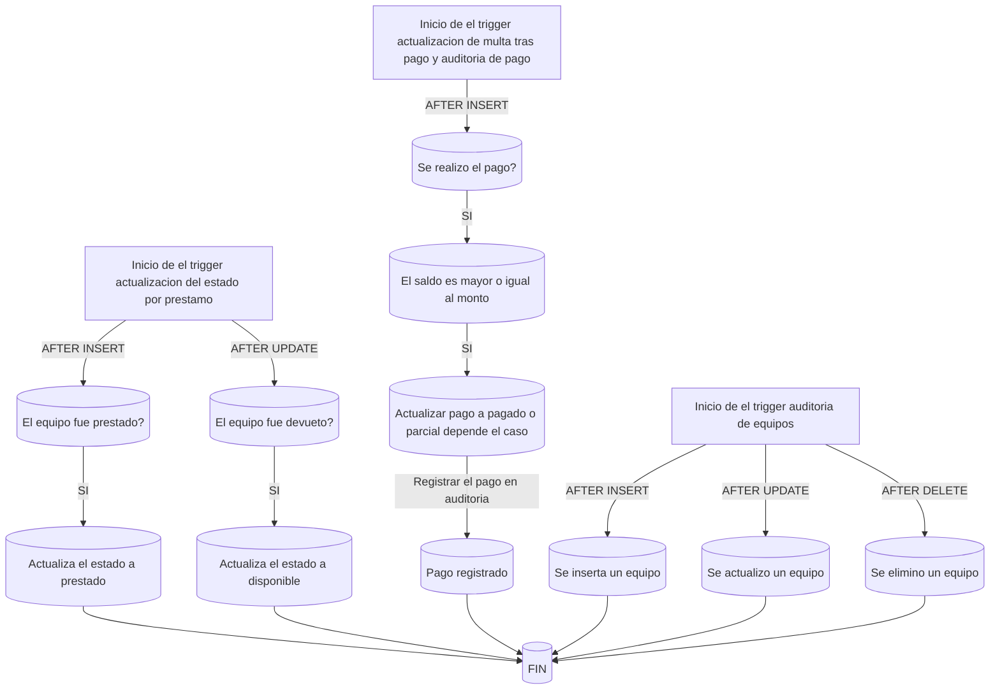
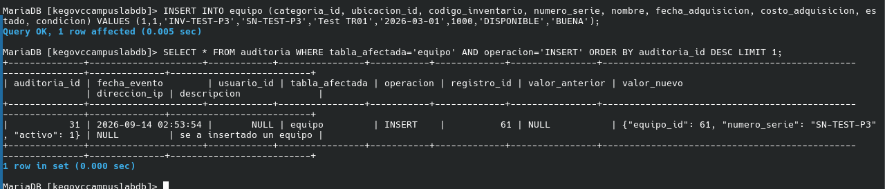
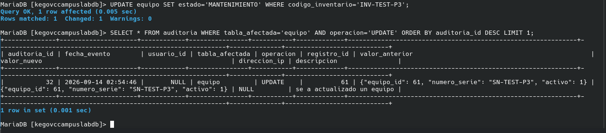
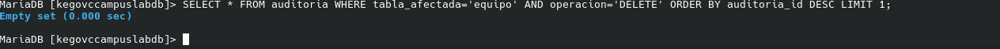
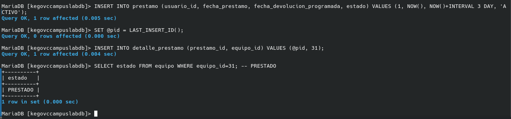
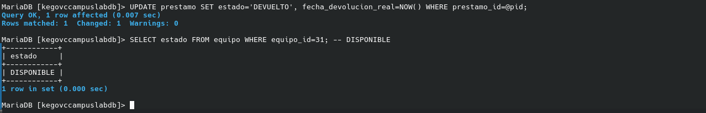
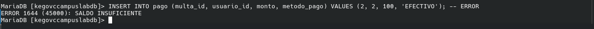
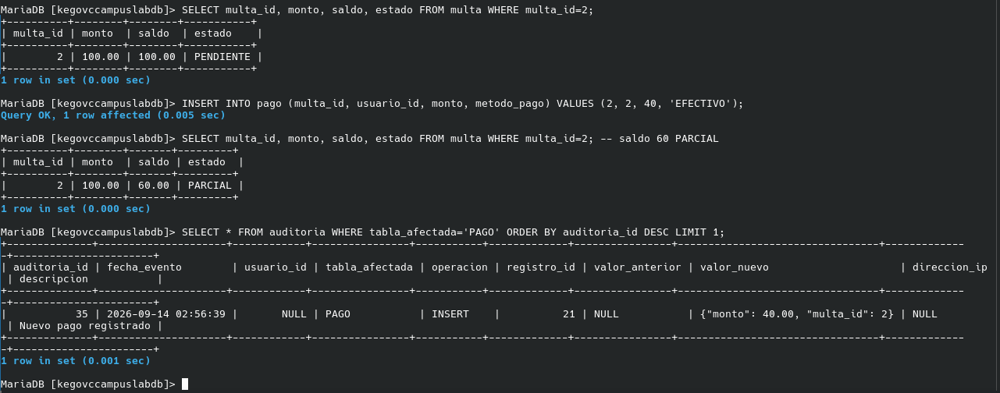

Reporte de practica 3 - TRIGGERS

Oziel Elias Rodriguez Gonzalez
Practica 3 Triggres
Base de Datos II
13/09/2026

---

Marco teorico:
Un trigger es una funcion de sql que nos permite hacer una validacion antes o despues de una accion ya sea un INSERT, UPDATE O DELETE de esta forma garantizamos que podamos elegir que se debe validar en que momentos para esto usamos AFTER Y BEFORE como su traduccion funcionan igual (after valida antes de aplicarse la accion y before depues de aplicarse ya sea INSERT etc... ) tambien tenemos dos palabras reservadas que son OLD.x y NEW.x lo que hacen es que old recupera el valor anterior de x y new le establece uno nuevo a x

---

Disenio:

---

Conclusion:
En esta practica fue casi igual a la de jobs ya que utilice el mismo formato de aprendizaje y realizacion mendainte los recursos que me proporciono mi profesor los cuales me ayudaron a ver la idea principal y sintaxis con eso y tiempo con el TR01 me tarde aproximandamente unas 5 horas ya que no entendia que se debia hacer en estas practicas me propuse hacerlas sin IA tanto la P2, P3  P4 gracias a esto ha sido muy cansado comprender todo pero se soluciona investigando sintaxis y problemas de codigo tambien supe que los triggers me ayudan a poder remplazar datos de una manera automatica y menos cansada.

---

Evicencias:

---

Comparativa:
en este caso mysql y postgres usan casi la misma sintaxis como en la forma de establecer OLD Y NEW que es la misma que seria NEW.x, OLD.x es lo mismo en ambos casos si bien postgres es mas eficiente por que tienes mas control sobre los mismos tiene una curva de aprendizaje mucho mayor lo que hace que no sea tan atractivo para aprender los fundamentos de los mismos en su defecto tiene muy pocos cambios si acaso su forma de control y flexibilidad y alguna que otra sintaxis pero los dos tienen la misma base.

---

Comandos

TR01/
-- TR01_INSERT
INSERT INTO equipo (categoria_id, ubicacion_id, codigo_inventario, numero_serie, nombre, fecha_adquisicion, costo_adquisicion, estado, condicion) VALUES (1,1,'INV-TEST-P3','SN-TEST-P3','Test TR01','2026-03-01',1000,'DISPONIBLE','BUENA');
SELECT * FROM auditoria WHERE tabla_afectada='equipo' AND operacion='INSERT' ORDER BY auditoria_id DESC LIMIT 1;

-- TR01_UPDATE
UPDATE equipo SET estado='MANTENIMIENTO' WHERE codigo_inventario='INV-TEST-P3';
SELECT * FROM auditoria WHERE tabla_afectada='equipo' AND operacion='UPDATE' ORDER BY auditoria_id DESC LIMIT 1;

-- TR01_DELETE
SELECT * FROM auditoria WHERE tabla_afectada='equipo' AND operacion='DELETE' ORDER BY auditoria_id DESC LIMIT 1;

TR02/
-- TR02_INSERT (PRESTADO)
INSERT INTO prestamo (usuario_id, fecha_prestamo, fecha_devolucion_programada, estado) VALUES (1, NOW(), NOW()+INTERVAL 3 DAY, 'ACTIVO');
SET @pid = LAST_INSERT_ID();
INSERT INTO detalle_prestamo (prestamo_id, equipo_id) VALUES (@pid, 31);
SELECT estado FROM equipo WHERE equipo_id=31; -- PRESTADO

-- TR02_UPDATE (DISPONIBLE)
UPDATE prestamo SET estado='DEVUELTO', fecha_devolucion_real=NOW() WHERE prestamo_id=@pid;
SELECT estado FROM equipo WHERE equipo_id=31; -- DISPONIBLE

TR03-04/
-- TR03 (PAGO)
SELECT multa_id, monto, saldo, estado FROM multa WHERE multa_id=2;
INSERT INTO pago (multa_id, usuario_id, monto, metodo_pago) VALUES (2, 2, 40, 'EFECTIVO');
SELECT multa_id, monto, saldo, estado FROM multa WHERE multa_id=2; -- saldo 60 PARCIAL
SELECT * FROM auditoria WHERE tabla_afectada='PAGO' ORDER BY auditoria_id DESC LIMIT 1;

-- TR03 ERROR (monto excede)
INSERT INTO pago (multa_id, usuario_id, monto, metodo_pago) VALUES (2, 2, 100, 'EFECTIVO'); -- ERROR
